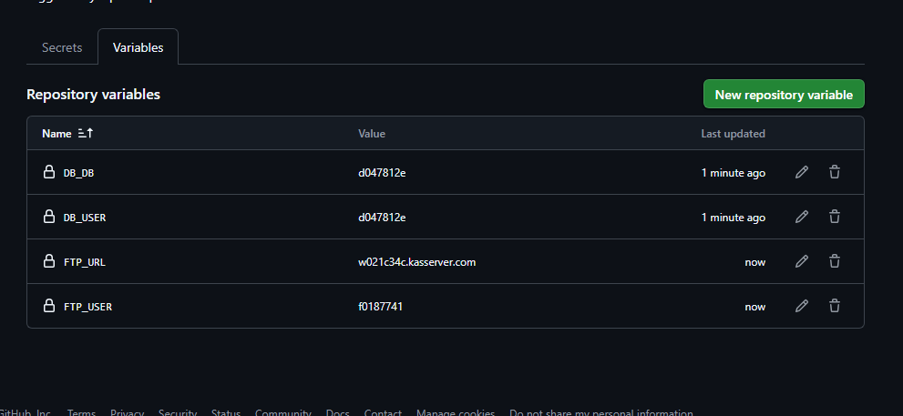
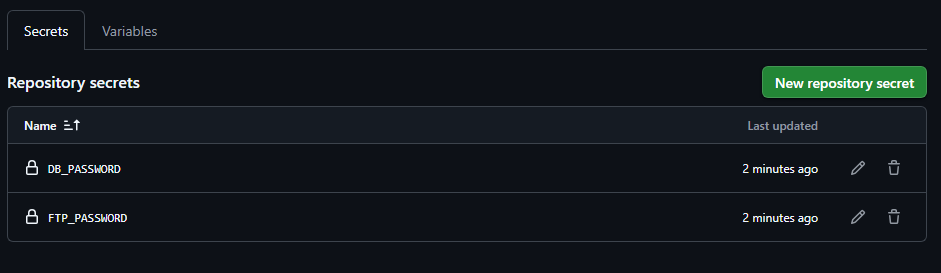

# UserManagement - Branch NS

Diese README beschreibt den aktuellen Stand für den Branch `NS`.

## Eingerichtete Zugänge

In GitHub sind Repository Variables und Secrets für FTP und Datenbank hinterlegt.

### Repository Variables



Verwendete Variablen:

- `FTP_URL`
- `FTP_USER`
- `DB_HOST` optional, wenn der Datenbankhost von `FTP_URL` abweicht
- `DB_DB`
- `DB_USER`

### Repository Secrets



Verwendete Secrets:

- `FTP_PASSWORD`
- `DB_PASSWORD`

## Deployment

Der Workflow `.github/workflows/upload-files.yml` lädt die Dateien per FTP hoch.

Auslöser:

- Push auf den Branch `NS`
- manueller Start über `workflow_dispatch`

Für den FTP-Upload werden diese GitHub-Werte verwendet:

- Server: `${{ vars.FTP_URL }}`
- Benutzer: `${{ vars.FTP_USER }}`
- Passwort: `${{ secrets.FTP_PASSWORD }}`

Vor dem Upload prüft der Workflow:

- FTP-Verbindung mit `FTP_URL`, `FTP_USER` und `FTP_PASSWORD`
- Datenbankverbindung mit `DB_HOST` oder ersatzweise `FTP_URL`, `DB_DB`, `DB_USER` und `DB_PASSWORD`

## Ordnerstruktur

```text
.
|-- .github/workflows/upload-files.yml
|-- cicd/README.md
|-- cicd/test-db-connection.sh
|-- cicd/test-ftp-connection.sh
|-- docs/images/
|   |-- github-secrets.png
|   `-- github-variables.png
|-- README.md
`-- README_NS.md
```
